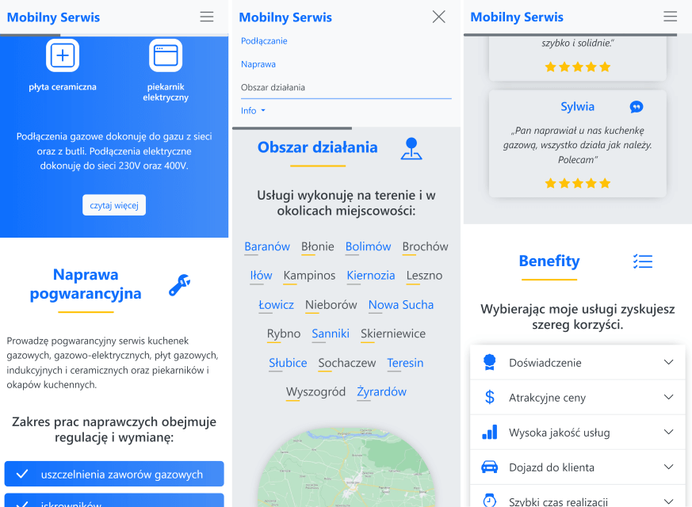

# Mobile service

Responsive home appliance technical service website containing elements of Bootstrap framework, styled according to service provider's guidelines.

## What i used
          

## Screenshots

## Live
[https://mobilny-serwis.netlify.app](https://mobilny-serwis.netlify.app)

## Solutions
- Styled according to service provider's guidelines
- Cooperation with the service provider
- Bootstrap styles, components and icons
- Implementation of a scrolling progress bar
- Task runners
- Webpack loaders and plugins
- Prettier code formatter